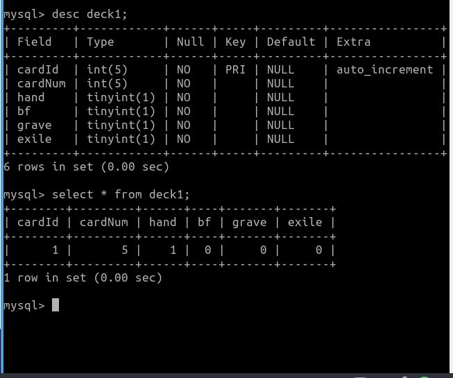

# mtg_game

## Vocabulary
**deck**: The cards you have collected into a deck

**library**: the deck shuffled into your library, where you will draw from. The library should display cards upside down

**draw**: draw means to draw a card from the library and put it in your hand

**play**: play means to select a card from your hand and place it on the battlefield

**battlefield**: where played cards are displayed

## Versions

### newMtg4a.html
This version provided system to:
* print the deck
* click the card in the deck to show it larger in a display area
* shuffle deck
* draw a card from the shuffled deck.
* The drawn cards have a button to play the card onto the battlefield

I ran into an issue with appending the drawn cards into an array. Later, in "woMtg1a" I learned how to append objects to an array

### woMtg1a
This version provided a system to:
* Create and parse a JSON object containing card information
* Grab the multiverseId-key value from the JSON object; the value corresponds with the card image file names
* Upon loading the page, a function that passes in the cards objects and appends them to an array using push
* The array is then displayed into a div element by concatenating multiverseId's embedded in an image call

Issues: The shuffle function I tried to bring over wasn't working, so the plan is to bring the append function to "newMtg4a"

## Image from an older version that utitlized mysql & php

