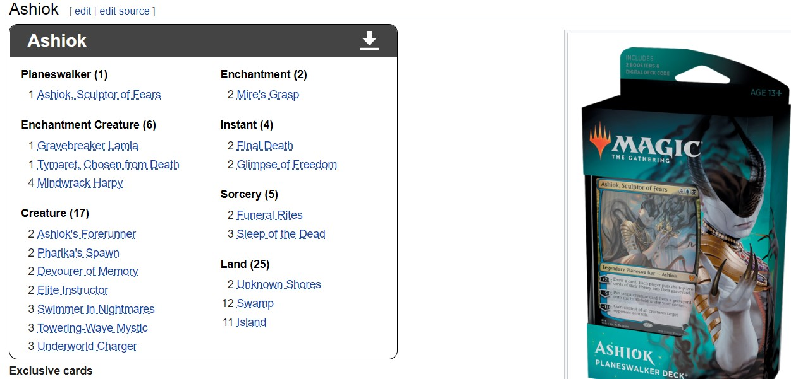
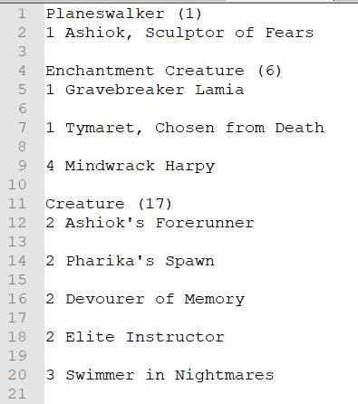
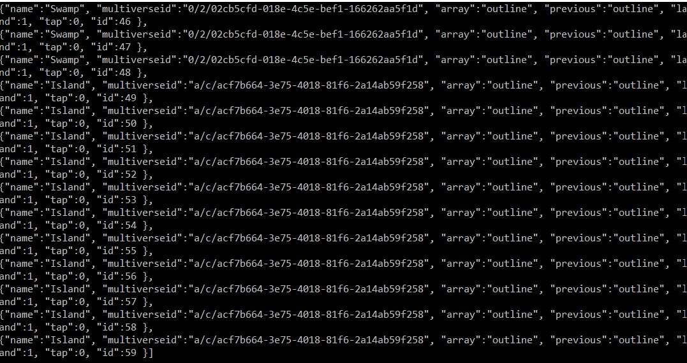

# mtg_game

## json creator

### pypyMtg3.py

json creator apps are for creating the json files that contain the data for the cards. The data includes the card name, the multiverseid, the array the card is located in, the previous array the card was located in, whether the card is a land, whether the card is tapped and an id for the card. In order to play with a particular deck, mtg_game reads from the json data file to obtain the data for the specific cards the player is using.

The multiverseid field is actually the scryfallid from the mtgjson file. The mtgjson file is from the mtgjson.com website under the "all decks" section. You download the json file (right click and save link as...). Then you run the json creator app.

The early versions of the json creator only extracted & processed the relevant fields from the mtgjson file. The early versions did not create json items for duplicate cards in a deck. So if a deck had 10 Islands, the json output would only include 1 Island, because only 1 Island is provided for in the mtgjson file.

The latest json creator app is pypyMtg3.py. This json creator opens and reads from two files. The first file (a txt file) is the deck list. The deck list is the quantity of each card the deck has. I get this quantity info from mtg.gamepedia.com. Here is an example:

Paste that info into a text file and the result looks like this:

pypyMtg3.py first opens the deck list text file and creates a dictionary of the quantities and "most" of the normal json data. It then opens the mtgjson file and extracts the relevant field values that mtg_game needs for data. For each item-set from the mtgjson file and for each quantity from the decklist, the json data file is created. The json creator does not add the id info until after all the cards per their quantities are added into the json data file. The final step of the pypyMtg3.py json data creation process adds the id numbers for each of the cards.

Here is the output that goes into the json data file which the website reads to display cards. Notice how there are 10 Islands each with their own id numbers:

This is the POC for allowing the player to choose any pre-made deck. To summarize the process:
1. Download the deck json data from mtgjson.com
2. Copy the deck list (with card quantities) from mtg.gamepdia.com into a txt file.
3. Run the json creator

What's next? Next is to allow the player to choose the deck from mtg_game. 

## Versions

jumpMtg: https://docs.google.com/document/d/1NWzzxAIT_11KQbuvCjg-kuFrw5Yel2Pqq0ppMk0yfNE/edit?usp=sharing

woMtg: https://docs.google.com/document/d/1sMlOk0TMnJvY5oHYg4cLns2mIeUA7QflAPtxhN18LyI/edit?usp=sharing

## Vocabulary
**deck**: The cards you have collected into a deck

**library**: the deck shuffled into your library, where you will draw from. The library should display cards upside down

**draw**: draw means to draw a card from the library and put it in your hand

**play**: play means to select a card from your hand and place it on the battlefield

**battlefield**: where played cards are displayed

## Functions
The following version contains the provided function:

* geMtg5b.html: lots of game functionalities, including tapping; var Enabled=true;
* panMtg5.html: update card quantities
* newMtg2cd.html: alert when user shuffles or leaves play

### var Enabled=true;
"var Enabled=true;" was used to fix issue with the "select()" card function not printing subsequently-selected cards after a card was already in "selected mode". By requiring Enabled to be true when select was run, I avoided the error by forcing the user to use the selected card before selecting another. Additional user-friendly function would to be to include an "X" or "cancel" button that returns the card to its original location (there's a JSON key for that original location called "previous").

## Versions

### geMtg5b.html
Now deep in JSON land -> cmd19a.json

### woMtg1b.html
This version builds on woMtg1a.html and adds:
* Prints a number input box, sized with CSS, next to each card in the deck-collection
* Each input box's id is a string multiverseId of the card
* There's also a shuffle function
* The shuffle copies the deck-array so we start with a fresh deck-array each shuffle instead of contstantly appending to it. This new deck-array is called library-array.
* The shuffle gets the quantity of the correct input box by it's id value (uses the multiverseId) and pushes the corresponding card-object into the library-array
* 

### woMtg1a.html
This version provided a system to:
* Create and parse a JSON object containing card information
* Grab the multiverseId-key value from the JSON object; the value corresponds with the card image file names
* Upon loading the page, a function that passes in the cards objects and appends them to an array using push
* The array is then displayed into a div element by concatenating multiverseId's embedded in an image call

Issues: The shuffle function I tried to bring over wasn't working, so the plan is to bring the append function to "newMtg4a"

### newMtg4a.html
This version provided system to:
* print the deck
* click the card in the deck to show it larger in a display area
* shuffle deck
* draw a card from the shuffled deck.
* The drawn cards have a button to play the card onto the battlefield

I ran into an issue with appending the drawn cards into an array. Later, in "woMtg1a" I learned how to append objects to an array

## Image from an older version that utitlized mysql & php

