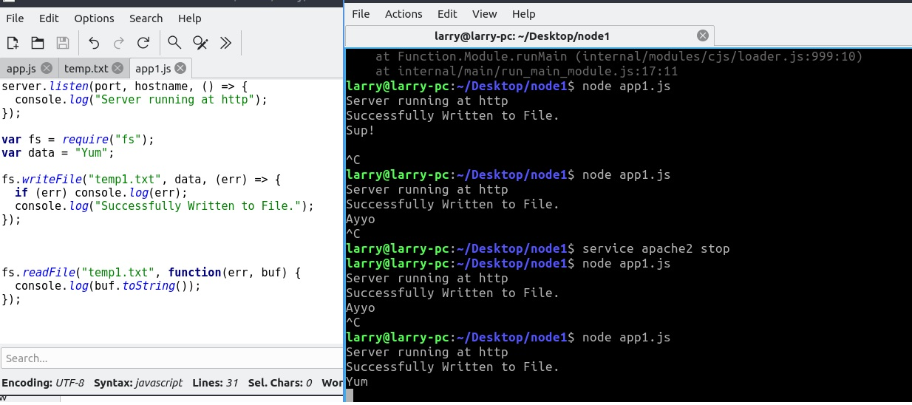

The app1.js file creates an http server. Not sure if that's necessary on top of requiring "fs" (filesystem). It also uses fs.writeFile() to write a string variable to a specified txt file and then read it. The pic also shows apache getting stopped and node running the app without apache.

